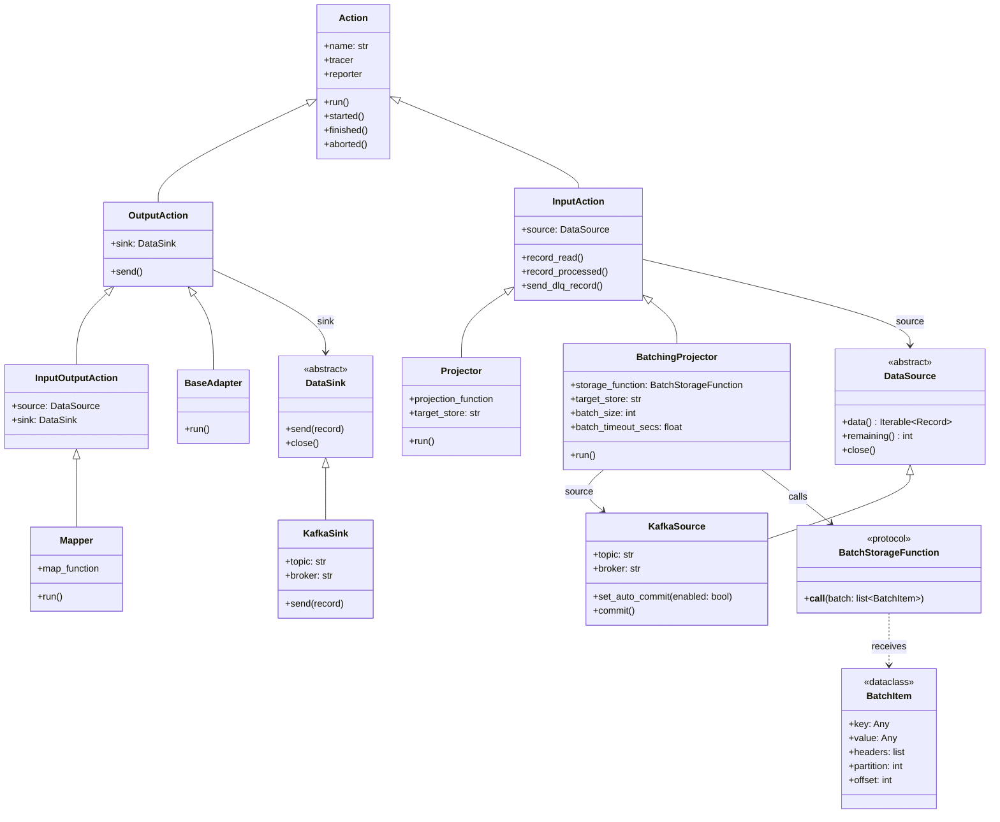

# telicent-lib

telicent-lib provides useful helper libraries for building Adaptors, Mappers and Projectors for the Telicent Core Platform.

## Dependencies

- Python 3.10 =\< 3.13
- Kafka*

*telicent-lib uses `confluent-kafka` to manage connections to Kafka. 
Please see [confluent-kafka's compatability documentation](https://docs.confluent.io/platform/current/installation/versions-interoperability.html) to ensure you have a compatible Kafka instance.


## Installation

```shell
pip install telicent-lib
```

## Usage

For documentation on how to use telicent-lib, please see the [documentation index](https://github.com/telicent-oss/telicent-lib/blob/main/docs/index.md).

## Class Diagram


